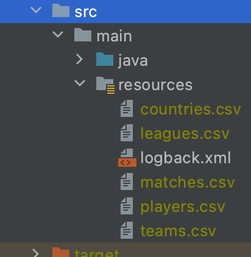
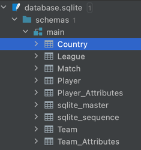

# Sirius Soccer ⚽️

## Background
This project is a solution to the semester group project in the course [TDT4250][] Advanced Software Design at [NTNU][].

[NTNU]: https://www.ntnu.edu/
[TDT4250]: https://www.ntnu.edu/studies/courses/TDT4250/2020/

## Case
**Part 1:** Create a parser to transform a publicly available data set into a format which can be used within the [Eclipse Modelling Framework (EMF)](https://www.eclipse.org/modeling/emf/) with Eclipse (XMI).

**Part 2:** Create an Ecore model of the data set using EMF.

**Part 3:** Create a tool using either Sirius (for creating a graphical view/editor) or Xtext (DSL) to either view or modify the existing data set.

## Solution
The group chose to use a [Soccer data set from kaggle.com](https://www.kaggle.com/hugomathien/soccer), which consist of soccer matches, teams and players from eight leagues for the seasons 2009-2016. The data was stored in an SQLite-database, which would first be parsed into a CSV-format using capabilities within IntelliJ and then be processed by a custom parser created by the group. In addition to the original structure of the data set, the parser creates multiple new tables and relations between the data - like season standings for teams, and player positions within a match (keeper, defence, midfield of forward). The format of the output from the parser corresponds to the Ecore model, so the tasks of modeling and parsing were done in parallel. Finally, a graphical tool using Sirius was made, which supports navigation of the data set with details about the teams and matches.

### Part 1: Running the Soccer DB parser code
This step expects that you to have an IDEA installed, preferably IntelliJ (for the database view). The parser code for part 1 of the assignment can be found [here](no.ntnu.soccer.parser/). Running the parser requires you to download the [data set](https://www.kaggle.com/hugomathien/soccer) from kaggle.com, then extract every table into separate CSV files using the filenames as shown in Figure 1, corresponding to the table from Figure 2 (see screenshots below).

**Figure 1:** _Screenhot of csv-files required in order to perform the parsing (from file explorer in IntelliJ)_

**Figure 2:** _Screenshot of the database tables defined in the SQLite-database (from Database view in IntelliJ)_

### Parser output (XMI)
The output file of the transformation can be found and opened directly in your browser [here](no.ntnu.soccer.parser/sample.soccer). In order to limit the file size of the data set, the group decided to perform parsing selecting only data from one country (England) and a single season (2015/2016). The [PerformParser.java](no.ntnu.soccer.parser/src/main/java/PerformParsing.java) may however easily be modified to include all countries and seasons.

### Part 2: Ecore Model
An Ecore model is in essence a representation of the domain, in this context, the soccer matches domain. It describes the various relations between the entities of the domain, and the constraints of both attributes and relations within an entity.

**Figure 3:** _Screenshot of the Ecore model_

### Part 3: Sirius

#### Launching Sirius from Eclipse

As a prerequisite, it is expected that you have Eclipse installed, with EMF / Sirius plugins installed. In order to run the Sirius modeling project ([no.ntnu.soccer.design](no.ntnu.soccer.design/)), you need to launch another instance of Eclipse with the Ecore model ([no.ntnu.soccer.model](no.ntnu.soccer.model/)) installed.

1.  Right-click on the **no.ntnu.soccer.model.editor** project and select **Run As** and then **Eclipse Application**
2.  Inside the new Eclipse Application click on **Import project…**.
3.  In the Import dialog, select **Existing Projects Into Workspace** and click **Next**.
4.  Add the location where you cloned this repository in **Select root directory** and click **Browse**.
5.  In the list of Projects, make sure that only **no.ntnu.soccer.design** and **no.ntnu.soccer.sample** are selected, and then click on **Finish**.

To edit the representations of diagrams and tables open the [soccer.odesign](no.ntnu.soccer.design/description/soccer.odesign) file as shown in Figure 7.

**Figure 7:** _Screenshot of soccer.odesign_

To view the diagrams and tables we have created, open the [representation.aird](no.ntnu.soccer.sample/representations.aird) file and select the view you want to open in the "Representation" tab.

**Figure 8:** _Screenshot of representation.aird_

#### Viewpoints

Different visualizations (viewpoints) have been created, which brings up relevant information to the user. For instance, viewpoints detailing a single match (Match viewpoint), or details about all matches that occurred on a single day with goal results (Match Day viewpoint).

##### Match Day Viewpoint

The Match Day viewpoint presents one match day in a season. A match day consists of a date and one or several matches. This viewpoint presents every match on a specified match day and visualizes if a team *won*, *lost* or if the match ended in a *draw*. The diagram consists of a match day node that presents the match date square, and inside each match container we have set several conditional styles to determine which team won and colour their respective container green, red or grey depending on the match result. A relation based edge is created to link the match day to each match.

**Figure 9:** _Screenshot of the match day view_

##### Match Viewpoint

The match viewpoint presents the teams and players who played the match. The presentation consists of a match node that contains the team short name, and an opponent container that contains all players and their positions. The opponent container is styled with an image of a soccer field and its children (positions) are presented as a vertical stack. The player nodes are inside the position container and are presented as a list.

**Figure 10:** _Screenshot of the match view_

##### Team Viewpoint

The Team viewpoint consists of a Team container which presents the information stored in the Team class (team details), and a Placements container which presents the teams placement information in a given season (one team may have many placements for each season they have played).

**Figure 11:** _Screenshot of the team view_

##### Season Standing Viewpoint

A table representation was created to visualize season standings.

**Figure 12:** _Screenshot of the season 2015/2016 table_

### Navigation between views

To be able to navigate between different diagrams we have added a bordered node on the match day view and match view (a "magnifying glass", indicating further detail levels). By using the navigation tool the user is directed to a different diagram by double-clicking, and if the diagram does not previously exist, a new one will be created.

- From match day to match: Double-click on the information icon labeled with **Show Match Information**.
- From match to team: Double-Click on the information icon labeled with **Show team information**.

#### Validations

Some semantic validation rules has been added on the Match day representation to ensure that each match has two opponents. An error message will be displayed if the match being validated doesn't have two opponents.

**Figure 13:** _Screenshot of validation_

#### Filters

Three filter functions have been added.

##### Draw-filter in the Match Day diagram

Filters out every match in a match day where the result is *draw*.

**Figure 14:** _Screenshot of the draw filter_

##### Keeper- and Defence-filter in the Match diagram

Used to filter out positions and the players contained inside that position.

**Figure 15:** _Screenshot of the position filter_

#### Creation Tools

##### Create a Match and Opponents in the match day diagram

We use a container creation tool to create a Match container. Since there are several values that needs to be set for a match we create a dialog windows where every feature of a match is displayed to the user so he can fill out necessary information.

**Figure 16:** _Screenshot of match creation_

**Figure 17:** _Screenshot of opponent creation_

**Figure 18:** _Screenshot of a match created with the creation tool_

##### Create Positions and Players in the match diagram

After a new match is created we can use the **createOpponent** tool to create one of the match opponents. A dialog window will appear where the user can choose the team and whether it is the *home* or *away* team. The references between match and opponents will be set automatically. You will have to repeat the last step for the opponent team as well (two opponents is required for a match).
